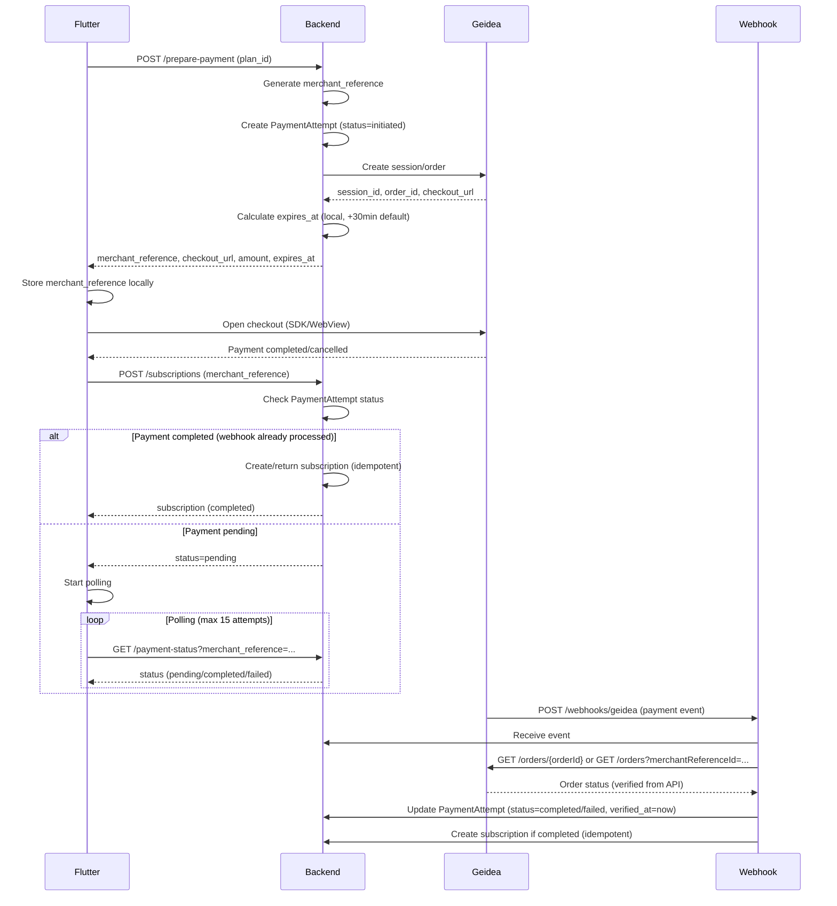

# Stripe → Geidea Migration Plan

## Overview

Complete removal of Stripe integration and replacement with Geidea payment gateway. The migration follows a backend-first approach where Flutter acts as a client, and webhooks are the source of truth for payment status.

## Architecture Flow



## Implementation Steps

### Phase 1: Database Schema

#### 1.1 Create PaymentAttempt Model & Migration

**File**: `database/migrations/YYYY_MM_DD_HHMMSS_create_payment_attempts_table.php`

Fields:

- `id` (pk)
- `user_id` (foreign key)
- `plan_id` (foreign key)
- `type` (enum: `subscription_create`, `subscription_upgrade`)
- `merchant_reference` (string, unique, indexed)
- `geidea_session_id` (nullable)
- `geidea_order_id` (nullable)
- `checkout_url` (nullable, text)
- `token_id` (nullable, for tokenization)
- `amount` (decimal)
- `currency` (string, default: SAR)
- `status` (enum: `initiated`, `pending`, `verifying`, `completed`, `failed`, `canceled`, `expired`)
- `failure_reason` (nullable, text)
- `subscription_id` (nullable, foreign key)
- `verified_at` (nullable, timestamp) - When payment was verified via Geidea API
- `metadata` (json, nullable)
- `created_at`, `updated_at`

**File**: `app/Models/Billing/PaymentAttempt.php`

- Relationships: `user()`, `plan()`, `subscription()`
- Scopes: `byStatus()`, `byMerchantReference()`, `pending()`, `verifying()`, `completed()`, `failed()`, `verified()`
- Methods: `markCompleted()`, `markFailed()`, `markVerifying()`, `isExpired()`, `markVerified()`

#### 1.2 Remove Stripe Fields (Data Migration)

**Files to modify**:

- `database/migrations/YYYY_MM_DD_HHMMSS_remove_stripe_fields_from_subscriptions.php`
- `database/migrations/YYYY_MM_DD_HHMMSS_remove_stripe_fields_from_users.php`
- `database/migrations/YYYY_MM_DD_HHMMSS_remove_stripe_fields_from_subscription_events.php`
- `database/migrations/YYYY_MM_DD_HHMMSS_remove_stripe_fields_from_financial_transactions.php`
- `database/migrations/YYYY_MM_DD_HHMMSS_remove_stripe_fields_from_payment_methods.php`

**Migration strategy** (Conservative approach):

- **Phase 1 (Initial)**: Keep Stripe DB fields in database (do not remove)
- Archive Stripe code to `archive/stripe/` directory for rollback capability
- Mark Stripe fields as deprecated in code but keep them for historical data
- **Phase 2 (After stable production window)**: 
  - Monitor production for at least 1 week with no payment regressions
  - Archive Stripe data to `stripe_archive` JSON column
  - Only then create migration to remove columns: `stripe_subscription_id`, `stripe_customer_id`, `stripe_payment_method_id`, `stripe_payment_intent_id`, `stripe_invoice_id`, `stripe_charge_id`, `stripe_event_id`

**Rationale**: Keep Stripe fields initially for rollback safety, remove only after stable production window.

### Phase 2: Geidea Service

#### 2.1 Create GeideaService

**File**: `app/Services/GeideaService.php`

Responsibilities:

- Initialize Geidea SDK/client with credentials from config (Basic Auth: publicKey + apiPassword)
- Create payment session/order
- Generate merchant_reference (UUID v4 or custom format)
- Fetch order/transaction from Geidea API for verification (webhook verification method)
- Retrieve payment status
- Handle tokenization (optional)

Key methods:

- `__construct()` - Initialize with publicKey and apiPassword from config (Basic Auth)
- `createPaymentSession(array $data): object` - Create Geidea session
- `getOrderByMerchantReference(string $merchantReference): object` - Fetch order from Geidea API
- `getOrderById(string $orderId): object` - Fetch order by ID from Geidea API
- `getPaymentStatus(string $merchantReference): object` - Query payment status (uses getOrderByMerchantReference)
- `generateMerchantReference(): string` - Generate unique reference

#### 2.2 Update Config

**File**: `config/services.php`

Add Geidea configuration:

```php
'geidea' => [
    'public_key' => env('GEIDEA_PUBLIC_KEY'), // Used as Basic Auth username
    'api_password' => env('GEIDEA_API_PASSWORD'), // Used as Basic Auth password
    'merchant_id' => env('GEIDEA_MERCHANT_ID'),
    'environment' => env('GEIDEA_ENVIRONMENT', 'sandbox'), // sandbox|production
    'base_url' => env('GEIDEA_BASE_URL'), // No hardcoded default - must be set in .env
],
```

**Note**: Geidea uses Basic Authentication where:

- `public_key` = username
- `api_password` = password

### Phase 3: Backend API Endpoints

#### 3.1 Prepare Payment Endpoint

**File**: `app/Http/Controllers/Billing/SubscriptionController.php`

**Route**: `POST /api/v1/user/subscriptions/prepare-payment`

**Request**:

```json
{
  "plan_id": 1,
  "type": "subscription_create", // optional, default
  "context": "app" // optional: app|web
}
```

**Response**:

```json
{
  "success": true,
  "data": {
    "merchant_reference": "uuid-here",
    "checkout_url": "https://...",
    "session_id": "...",
    "order_id": "...",
    "amount": 100.00,
    "currency": "SAR",
    "expires_at": "2024-01-01T12:00:00Z"
  }
}
```

**Implementation**:

- Validate plan exists and is active
- Generate unique `merchant_reference`
- Create `PaymentAttempt` with `status=initiated`
- Call `GeideaService::createPaymentSession()`
- Update `PaymentAttempt` with Geidea session/order IDs
- Calculate `expires_at` locally (default: +30 minutes from now) if not returned by Geidea
- Return response

**Important**: Do not assume `expires_at` is returned by Geidea. Calculate it locally if missing.

#### 3.2 Payment Status Endpoint

**File**: `app/Http/Controllers/Billing/SubscriptionController.php`

**Route**: `GET /api/v1/user/subscriptions/payment-status?merchant_reference=...`

**Response**:

```json
{
  "success": true,
  "data": {
    "status": "pending|completed|failed|not_found",
    "reason": "...", // if failed
    "subscription_id": 123, // if completed
    "updated_at": "2024-01-01T12:00:00Z"
  }
}
```

**Implementation**:

- Find `PaymentAttempt` by `merchant_reference` and `user_id`
- Return current status from database (fast path)
- **If status is `pending` and attempt is older than N seconds (e.g., 60s)**: 
  - Perform single Geidea API verification: `GET /orders?merchantReferenceId=...`
  - Update `PaymentAttempt` status based on API response
  - Set `verified_at` if payment verified
- If not found, return `not_found`

**Note**: This provides a fallback verification mechanism if webhook is delayed or missed.

#### 3.3 Create/Confirm Subscription Endpoint

**File**: `app/Http/Controllers/Billing/SubscriptionController.php`

**Route**: `POST /api/v1/user/subscriptions`

**Request**:

```json
{
  "plan_id": 1,
  "merchant_reference": "uuid-here",
  "auto_renew": true // optional
}
```

**Response**:

```json
{
  "success": true,
  "data": {
    "status": "completed|pending|failed",
    "subscription": {...}, // if completed
    "message": "..."
  }
}
```

**Implementation** (Idempotent):

- Find `PaymentAttempt` by `merchant_reference` and `user_id`
- If `PaymentAttempt.subscription_id` exists → return existing subscription (completed)
- Check `PaymentAttempt.status`:
  - `completed` → Create subscription if not exists, return it
  - `pending` → Return `status=pending`, let Flutter poll
  - `failed` → Return `status=failed` with reason
- Use database transaction to ensure atomicity

#### 3.4 Update Routes

**File**: `routes/api/v1/api_user.php`

Update subscription routes:

- Keep: `GET /subscriptions`, `GET /subscriptions/current`, `GET /subscriptions/{id}`
- Update: `POST /subscriptions/prepare-payment` (already exists, modify)
- Update: `POST /subscriptions` (change from `createWithPayment` to new logic)
- Add: `GET /subscriptions/payment-status`

### Phase 4: Webhook Handler

#### 4.1 Create GeideaWebhookController

**File**: `app/Http/Controllers/Billing/GeideaWebhookController.php`

**Route**: `POST /api/v1/webhooks/geidea` (public, no auth)

**Responsibilities**:

- Receive webhook event
- Extract `orderId` or `merchantReferenceId` from payload
- **Verify payment via Geidea API** (not signature verification - Geidea doesn't provide webhook signatures)
- Fetch order/transaction from Geidea API using `GET /orders/{orderId}` or `GET /orders?merchantReferenceId=...`
- Update `PaymentAttempt` status based on verified API response
- Set `verified_at` timestamp when payment is verified
- Create subscription if payment completed (idempotent)
- Log all events

**Key methods**:

- `handle(Request $request)` - Main webhook handler
- `verifyPaymentViaApi(string $orderId, ?string $merchantReference): object` - Fetch order from Geidea API (verification method)
- `processPaymentCompleted(array $data, object $verifiedOrder)` - Update attempt + create subscription
- `processPaymentFailed(array $data, object $verifiedOrder)` - Mark attempt as failed
- `findPaymentAttemptByReference(string $merchantReference): PaymentAttempt`

**Core Truth Principle** (Critical):

> **Payment truth comes ONLY from Geidea Orders API verification. Webhook is only a trigger, not a trusted final status.**

**Verification Strategy**:

1. Receive webhook payload (this is just a trigger/notification)
2. Extract `orderId` or `merchantReferenceId` from payload
3. **Always verify via Geidea API**: Call `GeideaService::getOrderByMerchantReference()` or `getOrderById()`
4. **Trust only the API response** - ignore webhook payload status
5. Update `PaymentAttempt` status based on verified API response
6. Set `verified_at` timestamp when payment is verified via API
7. Optionally set status to `verifying` before API call, then update to `completed`/`failed` after verification

**Idempotency**:

- Check if `PaymentAttempt` already processed (status=completed and verified_at is set)
- Use database transactions
- Log duplicate events but don't process twice
- **Never trust webhook payload alone - always verify via API**

#### 4.2 Update Routes

**File**: `routes/api/api.php`

Add webhook route:

```php
Route::post('webhooks/geidea', [GeideaWebhookController::class, 'handle']);
```

### Phase 5: Subscription Service Updates

#### 5.1 Update SubscriptionService

**File**: `app/Http/Services/Billing/SubscriptionService.php`

**Changes**:

- Remove all `StripeService` dependencies
- Remove methods: `createWithPaymentIntent()`, `createWithPayment()` (Stripe-specific)
- Add method: `createFromPaymentAttempt(PaymentAttempt $attempt, array $options = [])`
- Update `upgradeSubscription()` to use Geidea flow (if upgrade payments needed)
- Remove Stripe-related logic from all methods

**New method signature**:

```php
public function createFromPaymentAttempt(PaymentAttempt $attempt, array $options = []): Subscription
```

This method:

- Validates `PaymentAttempt.status === 'completed'`
- Checks if subscription already exists (idempotency)
- Creates subscription with plan details
- Links `PaymentAttempt.subscription_id`
- Creates `SubscriptionEvent`
- Creates `FinancialTransaction`
- Returns subscription

### Phase 6: Remove Stripe Code

#### 6.1 Files to Delete/Archive

- `app/Services/StripeService.php` → Archive to `archive/stripe/StripeService.php`
- `app/Http/Controllers/Billing/StripeWebhookController.php` → Archive
- `app/Console/Commands/SyncStripeSubscriptions.php` → Archive (if exists)

#### 6.2 Files to Update (Remove Stripe References)

- `app/Models/Billing/Subscription.php` - Remove Stripe fields from `$fillable`, update casts
- `app/Models/Billing/SubscriptionEvent.php` - Remove Stripe fields
- `app/Models/Billing/FinancialTransaction.php` - Remove Stripe fields
- `app/Models/Billing/PaymentMethod.php` - Remove or repurpose for Geidea tokens
- `app/Models/Users/User.php` - Remove `getStripeCustomer()`, Stripe fields
- `app/Http/Services/Billing/PaymentMethodService.php` - Remove or rewrite for Geidea
- `app/Http/Controllers/Billing/PaymentMethodController.php` - Update or remove
- `composer.json` - Remove `stripe/stripe-php` dependency

#### 6.3 Update Environment Config

**File**: `.env.example`

Remove:

- `STRIPE_KEY=`
- `STRIPE_SECRET=`
- `STRIPE_WEBHOOK_SECRET=`

Add:

- `GEIDEA_PUBLIC_KEY=` (Basic Auth username - required)
- `GEIDEA_API_PASSWORD=` (Basic Auth password - required)
- `GEIDEA_MERCHANT_ID=` (optional)
- `GEIDEA_ENVIRONMENT=sandbox` (sandbox|production)
- `GEIDEA_BASE_URL=` (required - no default, must be set explicitly)

### Phase 7: Testing & Validation

#### 7.1 Test Cases (Postman/cURL)

1. **Happy Path**: prepare → checkout → create → completed
2. **Webhook Delay**: prepare → checkout → create (pending) → polling → webhook → completed
3. **Payment Failed**: prepare → checkout → failed → webhook → failed status
4. **Idempotency**: create-subscription called twice → same subscription returned
5. **Resume Logic**: app killed → resume with merchant_reference → polling → completed
6. **Webhook Replay**: same webhook event twice → no duplicate subscription
7. **Expired Attempt**: old merchant_reference → expired status

#### 7.2 Observability

- Log `merchant_reference` in all steps
- Log webhook verification results
- Store `updated_at` in `PaymentAttempt` for polling accuracy
- Add monitoring for webhook failures

### Phase 8: Documentation

#### 8.1 Update API Documentation

**Files to update**:

- `docs/SUBSCRIPTIONS_FLUTTER_GUIDE.md` - Replace Stripe with Geidea flow
- `docs/FLUTTER_SUBSCRIPTION_EXPERIENCE.md` - Update with Geidea details
- Create: `docs/GEIDEA_INTEGRATION_GUIDE.md` - Complete Geidea setup guide

#### 8.2 Remove Stripe References

- Search codebase for "stripe" (case-insensitive)
- Update all documentation to remove Stripe mentions
- Archive old Stripe docs to `docs/archive/stripe/`

## Execution Order

1. **Phase 1**: Create `PaymentAttempt` model and migration (include `verified_at` field)
2. **Phase 2**: Create `GeideaService` with Basic Auth (public_key + api_password) and API fetch methods
3. **Phase 3.1**: Implement `prepare-payment` endpoint (calculate `expires_at` locally if missing)
4. **Phase 4**: Implement webhook handler with **API-based verification** (not signature-based)
5. **Phase 3.2**: Implement `payment-status` endpoint
6. **Phase 3.3**: Implement `create-subscription` endpoint (idempotent)
7. **Phase 5**: Update `SubscriptionService` to use `PaymentAttempt`
8. **Phase 1.2**: Keep Stripe DB fields initially (do not create removal migrations yet). Archive Stripe code only. After 1+ week stable production, then create removal migrations.
9. **Phase 6**: Remove/archive Stripe code
10. **Phase 7**: Testing with Geidea sandbox (verify all flows including API verification)
11. **Phase 8**: Update documentation

## Production Readiness Checklist

- [ ] **Core Truth**: Webhook handler ALWAYS verifies payments via Geidea API (never trusts webhook payload)
- [ ] `verified_at` timestamp is set when payment verified via API
- [ ] `expires_at` calculated locally if not returned by Geidea (default: +30 minutes)
- [ ] Basic Auth configured correctly (public_key + api_password)
- [ ] `GEIDEA_BASE_URL` set explicitly in .env (no hardcoded default)
- [ ] Payment status endpoint performs API verification fallback for old pending attempts
- [ ] All idempotency checks in place
- [ ] Monitoring for webhook failures and API verification failures
- [ ] Tested webhook replay scenarios (idempotent)
- [ ] Tested API verification failures and retries
- [ ] Tested payment status endpoint fallback verification
- [ ] Stripe code archived (not deleted) for rollback capability
- [ ] Stripe DB fields kept initially (not removed)
- [ ] No Stripe code references in new Geidea paths

## Critical Notes

1. **Core Truth**: Payment truth comes ONLY from Geidea Orders API verification. Webhook is only a trigger, not a trusted final status.
2. **Idempotency**: All `create-subscription` calls must be idempotent using `merchant_reference`
3. **Webhook Verification**: Geidea does NOT provide webhook signatures. Always verify payments by fetching order/transaction from Geidea API using `GET /orders/{orderId}` or `GET /orders?merchantReferenceId=...`
4. **Never Trust Webhook Payload**: Always verify via API before updating payment status
5. **Payment Status Endpoint**: If status is `pending` and attempt is old (>60s), perform single API verification as fallback
6. **Stripe Removal Strategy**: Keep Stripe DB fields initially, archive code for rollback. Remove fields only after stable production window (1+ week)
7. **No Stripe Leftovers in Code**: All Stripe code must be archived (not deleted) for rollback capability
8. **Backward Compatibility**: Existing Stripe subscriptions in DB will be preserved (fields kept initially)
9. **Testing**: Must test in Geidea sandbox before production deployment
10. **Authentication**: Geidea uses Basic Auth with `public_key` (username) and `api_password` (password)
11. **Base URL**: `GEIDEA_BASE_URL` must be set explicitly in .env (no hardcoded default)
12. **Expires At**: Do not assume `expires_at` is returned by Geidea. Calculate locally (default: +30 minutes) if missing
13. **Verified At**: Use `verified_at` timestamp to distinguish between webhook received and payment actually verified via API
14. **Verifying Status**: Optional `verifying` status can be set before API verification, then updated to `completed`/`failed` after

## Dependencies

- Geidea PHP SDK (if available) or HTTP client (Guzzle)
- UUID generation for `merchant_reference`
- Database transactions for atomicity