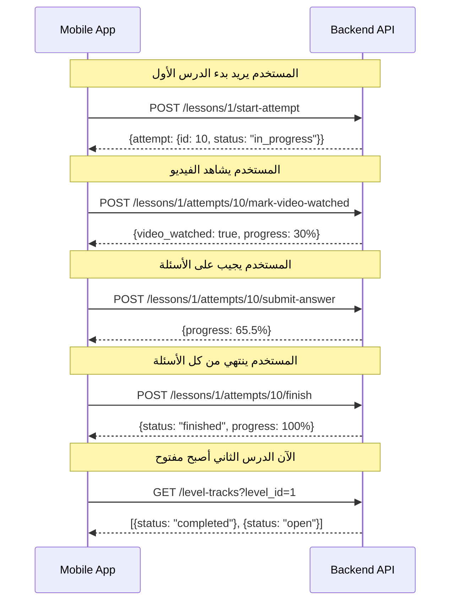
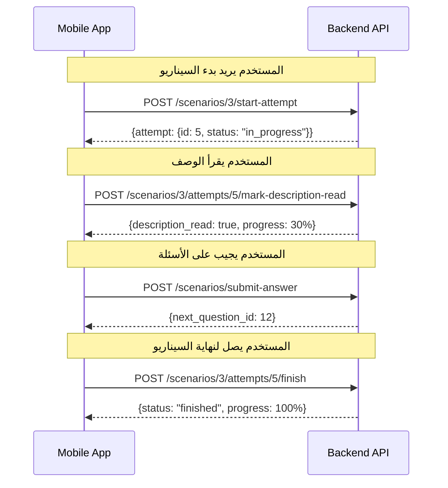

# نظام التقدم والقفل للدروس والسيناريوهات

## نظرة عامة

تم إضافة نظام متكامل لتتبع تقدم المستخدم في الدروس (Lessons) والسيناريوهات (Scenarios) مع آلية قفل/فتح تسلسلية. النظام يضمن أن المستخدم لا يمكنه فتح عنصر جديد إلا بعد إكمال العنصر السابق في نفس المستوى (Level).

---

## المبادئ الأساسية

### 1. التسلسل والقفل
- **أول عنصر** في المستوى يكون **مفتوح تلقائياً**
- باقي العناصر **مقفلة** حتى يكتمل العنصر السابق
- التسلسل يعمل على مستوى **LevelTrack** (يجمع الدروس والسيناريوهات معاً)

### 2. حساب نسبة الإنجاز

#### للدرس (Lesson):
- **30%** لمشاهدة الفيديو (`video_watched = true`)
- **70%** للإجابة على الأسئلة: `(عدد الأسئلة المجابة / إجمالي الأسئلة) * 70`
- إذا لم يكن هناك أسئلة: الفيديو يعطي **100%** من التقدم
- عند انتهاء المحاولة (status = finished): **100%**

#### للسيناريو (Scenario):
- **30%** لقراءة الوصف (`description_read = true`)
- **70%** عند انتهاء المحاولة (status = finished)
- **0%** إذا لم يبدأ بعد

### 3. حالات العناصر

كل عنصر (درس أو سيناريو) له **3 حالات**:

- **`locked`**: العنصر السابق غير مكتمل، لا يمكن الوصول له
- **`open`**: العنصر مفتوح وجاري العمل عليه (0% - 99%)
- **`completed`**: العنصر مكتمل (أول محاولة منتهية = 100%)

**ملاحظة مهمة**: المحاولات التكرارية **لا تؤثر** على حالة الاكتمال. بمجرد إكمال المحاولة الأولى، العنصر يعتبر مكتملاً للأبد.

---

## التغييرات في API Response

### 1. LevelTrack Resource

عند جلب `LevelTrack`، ستجد الحقول الجديدة التالية:

```json
{
  "id": 1,
  "level_id": 1,
  "trackable_id": 5,
  "trackable_type": "App\\Models\\Learning\\Lesson",
  "order_index": 1,
  "status": "completed",           // جديد: locked, open, completed
  "progress_percentage": 100,      // جديد: 0-100
  "is_accessible": true,           // جديد: true/false
  "trackable": {
    // Lesson أو Scenario object
  }
}
```

### 2. Lesson Resource

عند جلب `Lesson` مباشرة:

```json
{
  "id": 5,
  "level_id": 1,
  "title": "الدرس الأول",
  "status": "open",                // جديد: locked, open, completed
  "progress_percentage": 65.5,     // جديد: 0-100
  // ... باقي الحقول
}
```

### 3. Scenario Resource

عند جلب `Scenario` مباشرة:

```json
{
  "id": 3,
  "level_id": 1,
  "title": "السيناريو الأول",
  "status": "locked",              // جديد: locked, open, completed
  "progress_percentage": 0,        // جديد: 0-100
  // ... باقي الحقول
}
```

---

## API Endpoints الجديدة

### 1. تحديد مشاهدة الفيديو (Lesson)

**Endpoint:** `POST /api/v1/user/lessons/{lessonId}/attempts/{attemptId}/mark-video-watched`

**Headers:**
```
Authorization: Bearer {token}
Accept: application/json
```

**Response Success (200):**
```json
{
  "success": true,
  "message": "messages.video.marked_watched",
  "data": {
    "id": 10,
    "user_id": 1,
    "lesson_id": 5,
    "status": "in_progress",
    "video_watched": true,
    "video_watched_at": "2026-01-06T22:45:30.000000Z",
    "started_at": "2026-01-06T22:30:00.000000Z",
    // ... باقي الحقول
  }
}
```

**ملاحظات:**
- هذا الـ endpoint يحدد أن المستخدم شاهد الفيديو
- يحسب **30%** من التقدم للدرس
- يمكن استدعاؤه مرة واحدة فقط (idempotent)

---

### 2. تحديد قراءة الوصف (Scenario)

**Endpoint:** `POST /api/v1/user/scenarios/{id}/attempts/{attemptId}/mark-description-read`

**Headers:**
```
Authorization: Bearer {token}
Accept: application/json
```

**Response Success (200):**
```json
{
  "success": true,
  "message": "messages.description.marked_read",
  "data": {
    "id": 5,
    "user_id": 1,
    "scenario_id": 3,
    "status": "in_progress",
    "description_read": true,
    "description_read_at": "2026-01-06T22:45:30.000000Z",
    "started_at": "2026-01-06T22:30:00.000000Z",
    // ... باقي الحقول
  }
}
```

**ملاحظات:**
- هذا الـ endpoint يحدد أن المستخدم قرأ الوصف
- يحسب **30%** من التقدم للسيناريو
- يمكن استدعاؤه مرة واحدة فقط (idempotent)

---

## التغييرات في الـ Endpoints الموجودة

### 1. بدء المحاولة (Lesson)

**Endpoint:** `POST /api/v1/user/lessons/{lessonId}/start-attempt`

**التحقق الجديد:**
- إذا كان الدرس **مقفل** (`locked`)، سيتم إرجاع **403 Forbidden**
- الرسالة: `"messages.lesson.locked"`

**Response Error (403):**
```json
{
  "success": false,
  "message": "messages.lesson.locked",
  "status": 403
}
```

---

### 2. بدء المحاولة (Scenario)

**Endpoint:** `POST /api/v1/user/scenarios/{id}/start-attempt`

**التحقق الجديد:**
- إذا كان السيناريو **مقفل** (`locked`)، سيتم إرجاع **403 Forbidden**
- الرسالة: `"messages.scenario.locked"`

**Response Error (403):**
```json
{
  "success": false,
  "message": "messages.scenario.locked",
  "status": 403
}
```

---

## مثال على Flow كامل

### مثال 1: درس مع فيديو وأسئلة



### مثال 2: سيناريو



---

## استخدام الحقول الجديدة في Mobile App

### 1. عرض حالة العنصر

```typescript
interface TrackItem {
  id: number;
  order_index: number;
  status: 'locked' | 'open' | 'completed';
  progress_percentage: number;
  is_accessible: boolean;
  trackable: Lesson | Scenario;
}

// عرض القفل/الفتح
if (track.status === 'locked') {
  // إظهار أيقونة القفل
  // تعطيل زر البدء
  // إظهار رسالة: "أكمل العنصر السابق أولاً"
} else if (track.status === 'open') {
  // إظهار زر "ابدأ" أو "استمر"
  // عرض شريط التقدم
} else if (track.status === 'completed') {
  // إظهار أيقونة الإكمال ✓
  // إظهار زر "إعادة المحاولة"
  // إظهار شريط التقدم 100%
}
```

### 2. عرض شريط التقدم

```typescript
// للدرس
const progressPercentage = lesson.progress_percentage; // 0-100

// عرض شريط التقدم
<ProgressBar 
  value={progressPercentage} 
  max={100}
  label={`${progressPercentage}%`}
/>

// تقسيم التقدم للدرس
const videoProgress = attempt.video_watched ? 30 : 0;
const questionsProgress = (answeredQuestions / totalQuestions) * 70;
```

### 3. التحقق قبل البدء

```typescript
// قبل بدء الدرس
async function startLesson(lessonId: number) {
  // جلب الدرس أولاً للتحقق من الحالة
  const lesson = await fetchLesson(lessonId);
  
  if (lesson.status === 'locked') {
    showError('هذا الدرس مقفل. أكمل الدرس السابق أولاً.');
    return;
  }
  
  if (!lesson.is_accessible) {
    showError('لا يمكنك الوصول لهذا الدرس الآن.');
    return;
  }
  
  // بدء المحاولة
  const attempt = await startLessonAttempt(lessonId);
}
```

---

## أمثلة Response كاملة

### جلب Level Tracks لمستوى معين

**Request:**
```
GET /api/v1/user/level-tracks?level_id=1
```

**Response:**
```json
{
  "success": true,
  "data": [
    {
      "id": 1,
      "level_id": 1,
      "trackable_id": 5,
      "trackable_type": "App\\Models\\Learning\\Lesson",
      "order_index": 1,
      "status": "completed",
      "progress_percentage": 100,
      "is_accessible": true,
      "trackable": {
        "id": 5,
        "title": "الدرس الأول",
        "status": "completed",
        "progress_percentage": 100
      }
    },
    {
      "id": 2,
      "level_id": 1,
      "trackable_id": 3,
      "trackable_type": "App\\Models\\Scenarios\\Scenario",
      "order_index": 2,
      "status": "open",
      "progress_percentage": 30,
      "is_accessible": true,
      "trackable": {
        "id": 3,
        "title": "السيناريو الأول",
        "status": "open",
        "progress_percentage": 30
      }
    },
    {
      "id": 3,
      "level_id": 1,
      "trackable_id": 6,
      "trackable_type": "App\\Models\\Learning\\Lesson",
      "order_index": 3,
      "status": "locked",
      "progress_percentage": 0,
      "is_accessible": false,
      "trackable": {
        "id": 6,
        "title": "الدرس الثاني",
        "status": "locked",
        "progress_percentage": 0
      }
    }
  ]
}
```

---

## جداول الحالات

### حالات LevelTrack

| الحالة | المعنى | `is_accessible` | `progress_percentage` |
|--------|--------|-----------------|----------------------|
| `locked` | العنصر السابق غير مكتمل | `false` | `0` |
| `open` | العنصر مفتوح وجاري العمل | `true` | `0-99` |
| `completed` | العنصر مكتمل (أول محاولة منتهية) | `true` | `100` |

### حساب التقدم للدرس

| الحالة | الفيديو | الأسئلة | التقدم الكلي |
|--------|---------|---------|--------------|
| لم يبدأ | ❌ | 0/10 | `0%` |
| شاهد الفيديو فقط | ✅ | 0/10 | `30%` |
| شاهد + أجاب 5 أسئلة | ✅ | 5/10 | `30% + 35% = 65%` |
| شاهد + أجاب كل الأسئلة | ✅ | 10/10 | `30% + 70% = 100%` |
| محاولة منتهية | ✅ | 10/10 | `100%` (بغض النظر) |

### حساب التقدم للسيناريو

| الحالة | قراءة الوصف | انتهاء المحاولة | التقدم الكلي |
|--------|-------------|-----------------|--------------|
| لم يبدأ | ❌ | ❌ | `0%` |
| قرأ الوصف فقط | ✅ | ❌ | `30%` |
| قرأ + انتهى المحاولة | ✅ | ✅ | `30% + 70% = 100%` |

---

## ملاحظات مهمة للمطور

### 1. Cache والتحديث

- **لا تقم بعمل cache** لحالة `status` و `progress_percentage`
- هذه الحقول تتغير دائماً، لذا احرص على جلبها من الـ API دائماً
- يمكنك عمل cache للبيانات الثابتة (مثل `title`, `description`)

### 2. Real-time Updates

- عند انتهاء محاولة، **حدّث UI مباشرة**
- لا تنتظر refresh للصفحة
- استخدم الـ callbacks لتحديث الحالة

### 3. Error Handling

```typescript
// عند محاولة بدء درس مقفل
try {
  await startLessonAttempt(lessonId);
} catch (error) {
  if (error.status === 403 && error.message === 'messages.lesson.locked') {
    showError('هذا الدرس مقفل. أكمل الدرس السابق أولاً.');
  }
}
```

### 4. Offline Support

- يمكن حفظ `video_watched` و `description_read` محلياً
- عند الاتصال بالإنترنت، أرسل الطلب للـ API
- تأكد من معالجة الأخطاء إذا كان الطلب فشل

---

## API Endpoints Summary

### الجديدة

| Method | Endpoint | الوصف |
|--------|----------|-------|
| `POST` | `/user/lessons/{lessonId}/attempts/{attemptId}/mark-video-watched` | تحديد مشاهدة الفيديو |
| `POST` | `/user/scenarios/{id}/attempts/{attemptId}/mark-description-read` | تحديد قراءة الوصف |

### المعدلة (مع validation جديد)

| Method | Endpoint | التغيير |
|--------|----------|---------|
| `POST` | `/user/lessons/{lessonId}/start-attempt` | التحقق من القفل |
| `POST` | `/user/scenarios/{id}/start-attempt` | التحقق من القفل |

### المحدثة Response

| Endpoint | الحقول الجديدة |
|----------|-----------------|
| `GET /user/level-tracks` | `status`, `progress_percentage`, `is_accessible` |
| `GET /user/lessons/{id}` | `status`, `progress_percentage` |
| `GET /user/scenarios/{id}` | `status`, `progress_percentage` |

---

## الأسئلة الشائعة

### Q: ماذا يحدث إذا حاول المستخدم فتح درس مقفل؟

**A:** سيرجع الـ API **403 Forbidden** مع الرسالة `messages.lesson.locked` أو `messages.scenario.locked`.

### Q: كيف أعرف إذا كان العنصر مفتوح أم مقفل؟

**A:** استخدم حقل `status`:
- `locked` = مقفل
- `open` = مفتوح
- `completed` = مكتمل

أو استخدم `is_accessible`:
- `true` = يمكن الوصول
- `false` = مقفل

### Q: هل يمكن للمستخدم إعادة محاولة درس مكتمل؟

**A:** نعم، المستخدم يمكنه إعادة المحاولة بأي وقت. لكن `status` سيبقى `completed` و `progress_percentage` سيبقى `100%`.

### Q: ماذا يحدث إذا لم يكن هناك أسئلة في الدرس؟

**A:** إذا لم يكن هناك أسئلة، مشاهدة الفيديو تعطي **100%** من التقدم.

### Q: كيف أحسب التقدم يدوياً في الـ App؟

**A:** لا حاجة! استخدم `progress_percentage` من الـ API. لكن إذا أردت:

**للدرس:**
```
progress = (video_watched ? 30 : 0) + (answered_questions / total_questions * 70)
```

**للسيناريو:**
```
progress = (description_read ? 30 : 0) + (finished ? 70 : 0)
```

---

## الخلاصة

- ✅ نظام قفل/فتح تسلسلي يعمل على مستوى LevelTrack
- ✅ حساب تقدم دقيق للدروس (30% فيديو + 70% أسئلة)
- ✅ حساب تقدم للسيناريوهات (30% قراءة + 70% انتهاء)
- ✅ حالات واضحة: `locked`, `open`, `completed`
- ✅ APIs جديدة لتحديد مشاهدة الفيديو وقراءة الوصف
- ✅ Validation عند بدء المحاولة لمنع الوصول للمقفل

---

**آخر تحديث:** 2026-01-06  
**الإصدار:** 1.0.0

