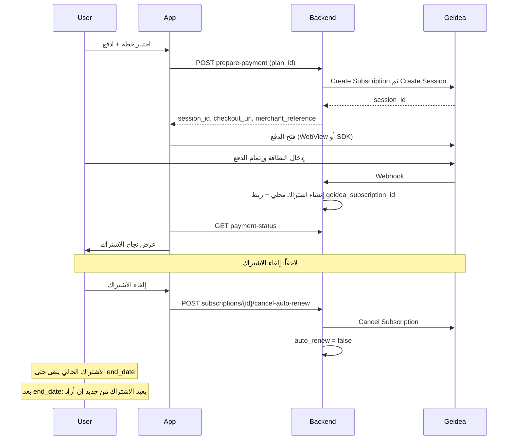

# نموذج الاشتراك النهائي (مرجع واحد)

هذا المستند يعرّف نموذج الاشتراك المعتمد للتدقيق والتنفيذ. كل من الباكند والموبايل والتوثيق يلتزم به.

---

## 1. المفهوم: اشتراك عادي

- **ما نقدّمه:** اشتراك عادي. هذا الاشتراك يبقى يتجدد تلقائياً ما لم يتم إلغاؤه.
- **التجديد:** الاشتراك يتجدد تلقائياً عند انتهاء المدة (Geidea تخصم تلقائياً). لا نُظهر للمستخدم خيار تفعيل/إلغاء التجديد عند الاشتراك.
- **الترمينولوجيا:** نستخدم لفظ **"إلغاء الاشتراك"** في الواجهة. المقصود: إيقاف التجديد التلقائي فقط (انظر أدناه).

---

## 2. إلغاء الاشتراك

- **المعنى:** المستخدم يلغي الاشتراك = نوقف **التجديد التلقائي** فقط. الاشتراك **الحالي** يبقى شغالاً حتى نهاية المدة (شهر، 3 أشهر، سنة، حسب الخطة).
- **لا تأثير على:** المبلغ المدفوع، فترة الاشتراك الحالية، أو الوصول حتى تاريخ الانتهاء.
- **التنفيذ (باكند):** استدعاء Cancel Subscription عند Geidea (إن وُجد `geidea_subscription_id`) + وضع `auto_renew = false` محلياً. لا تغيير في `status` ولا `end_date`.

---

## 3. بعد الإلغاء — لا إعادة تفعيل

- **لا يوجد "إعادة تفعيل" أو "استئناف الاشتراك"** بعد الإلغاء. Geidea لا توفر API لاستئناف اشتراك ملغى.
- **الطريقة الوحيدة للاشتراك مرة أخرى:** بعد أن **ينتهي** الاشتراك الحالي (بعد `end_date`)، المستخدم يعيد الاشتراك من جديد (اختيار خطة + دفع) كاشتراك جديد.
- **الواجهة:** لا نعرض زر "إعادة تفعيل التجديد" أو "استئناف الاشتراك". إن انتهى الاشتراك ورغب المستخدم بالاستمرار، يعيد الاشتراك من البداية.

---

## 4. التدفق المعتمد (مرجع سريع)

---

## 5. الباكند (قواعد التنفيذ)

| البند | القرار |
|-------|--------|
| prepare-payment | اعتبار كل طلب "اشتراك مع تجديد تلقائي". استدعاء Create Subscription عند Geidea ثم Create Session مع `subscriptionId`. لا حاجة لخيار `auto_renew` من التطبيق (أو نعتبره دائماً `true`). |
| إلغاء الاشتراك | Endpoint: `POST /api/v1/user/subscriptions/{id}/cancel-auto-renew`. يستدعي Geidea Cancel إن وُجد `geidea_subscription_id` ويضع `auto_renew = false` محلياً. |
| استئناف التجديد | **غير معروض للمستخدم.** إن بقي endpoint "resume-auto-renew" للاستخدام الداخلي/أدمن، يُوثَّق أنه يغيّر الحالة المحلية فقط ولا يعيد التفاعل مع Geidea. |

---

## 6. الموبايل (قواعد الواجهة والـ API)

- عند الاشتراك: استدعاء prepare-payment مع `plan_id` فقط (بدون خيار تجديد تلقائي). فتح الدفع ثم payment-status ثم عرض الاشتراك.
- عرض "إلغاء الاشتراك" للمشترك الحالي؛ عند الضغط استدعاء cancel-auto-renew. توضيح للمستخدم: "الاشتراك الحالي يبقى حتى [end_date] ولن يتجدد تلقائياً بعدها."
- عدم عرض "إعادة تفعيل التجديد" أو "استئناف الاشتراك". بعد انتهاء الاشتراك، عرض خيار "الاشتراك من جديد" (نفس تدفق الاشتراك الأول).

---

## 7. ملخص بجملة واحدة

**اشتراك عادي، والاشتراك يبقى يتجدد ما لم يتم إلغاؤه. عند الإلغاء: إيقاف التجديد مع بقاء الفترة الحالية؛ بعد انتهاء المدة يمكن الاشتراك من جديد فقط.**
